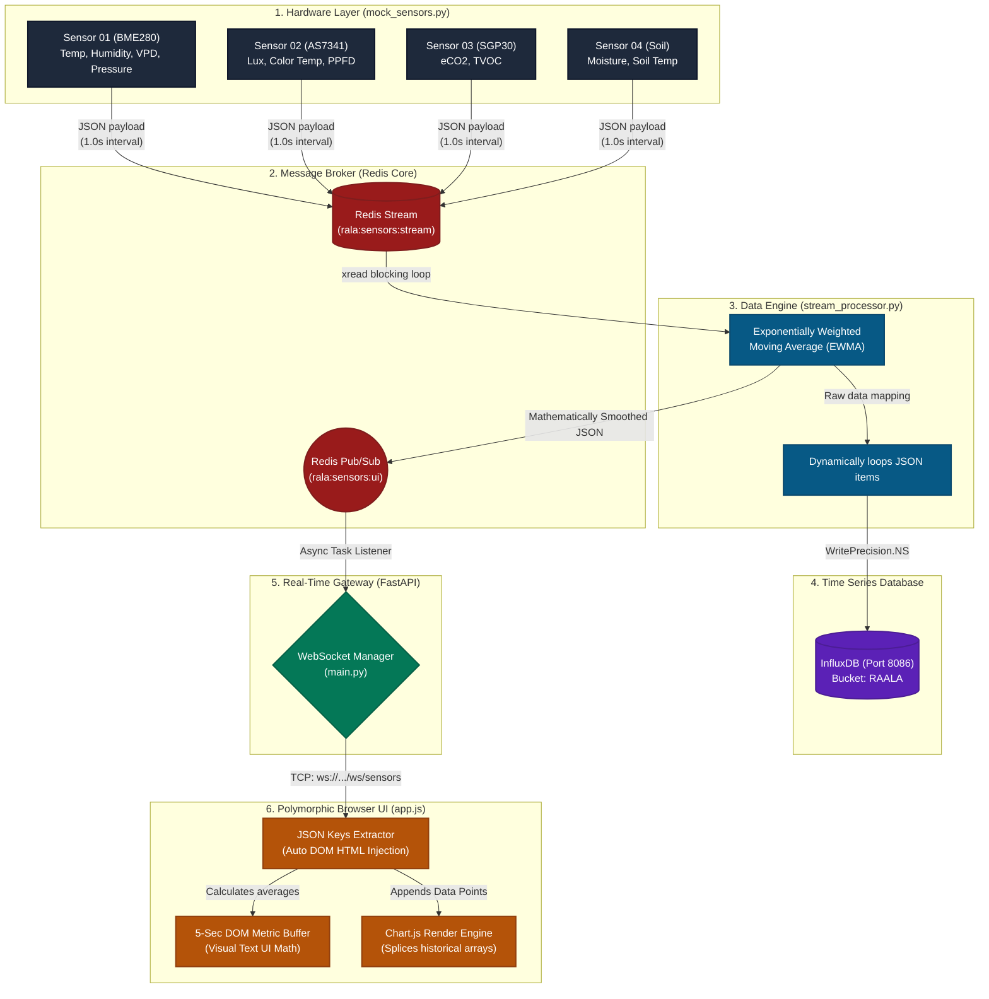

# RAALA Sensor Simulator Architecture
### High-Level System Design & Pipeline Flow

The RAALA Simulator is a highly scalable, decoupled microservice architecture designed to mimic a massive real-time IoT agricultural greenhouse. It guarantees zero data-loss through persistent streams, suppresses physical hardware noise using mathematical smoothing, and delivers real-time telemetry to the browser over persistent TCP sockets.

---

## Complete Data Flow Architecture

---

## 1. The Mock Hardware Layer (`mock_sensors.py`)
**Role:** Simulates the physical hardware chips (I2C/Analog) attached to Raspberry Pi/Arduino microcontrollers in the greenhouse.
- **Polymorphic Generation:** It does not use rigid classes. Instead, it generates distinct JSON dictionaries representing unique hardware signatures (e.g., Adafruit BME280 generates `temperature/humidity/pressure/vpd`, while the AS7341 generates `lux/color_temp/ppfd`).
- **Data Drift Mechanics:** Uses Gaussian noise and controlled random-walk algorithms anchored to a baseline to simulate authentic environmental micro-fluctuations over time.
- **Egress:** Pushes raw payloads into a high-throughput **Redis Stream** (`rala:sensors:stream`) every 1.0 seconds.

## 2. The Message Broker (Redis)
**Role:** The universal nervous system connecting the hardware to the database and the web server.
- **Streams (Persistence):** Acts as a durable buffer. If the database crashes, the hardware data queue backs up in the Redis Stream securely until the DB comes back online.
- **Pub/Sub (Fire-and-Forget):** Once data is cleaned by the stream processor, it is blasted to all active web clients through a lightning-fast memory channel (`rala:sensors:ui`).

## 3. The Data Engine (`stream_processor.py`)
**Role:** The intermediary logic gate connecting raw data to the database and the front-end servers.
- **Schema-Agnostic Processing:** It intercepts the polymorphic JSON. Rather than hard-coding column names, it iterates natively over arbitrary keys.
- **EWMA Mathematical Smoothing:** Applies an Exponentially Weighted Moving Average (`alpha=0.2`) to all numeric values. This flattens out erratic voltage spikes typical of cheap hardware sensors before it reaches the UI.
- **InfluxDB Archiving:** Writes the cleaned time-series data into the persistent InfluxDB bucket.
- **Egress:** Publishes the smoothed JSON object out to the Redis Pub/Sub channel.

## 4. The Real-Time Gateway (FastAPI)
**Role:** A massive concurrency router handling thousands of incoming browser connections.
- **Async WebSockets:** Upgrades standard HTTP connections to persistent two-way TCP lines via `ws://.../ws/sensors`.
- **Redis Listener Thread:** Spawns an asynchronous background task (`asyncio.create_task`) that continuously listens to the Redis Pub/Sub channel. Whenever a smoothed payload arrives, the FastAPI server instantly broadcasts it to every single connected browser.

## 5. The Polymorphic Client (`app.js`)
**Role:** The dynamic browser rendering engine.
- **Zero-Config DOM Injection:** When `app.js` connects via WebSocket, it intercepts the JSON payload. Instead of looking for hard-coded HTML layout grids, it reads the JSON keys, maps them to physical SI units (`°C`, `ppm`, `lx`), and dynamically constructs the HTML metric tracking cards via Javascript Injection.
- **Memory Scaling:** Maintains a 5-second `dataBuffer` to prevent CPU-thrashing DOM updates, meaning the heavy Chart.js graphics render at 1 frame-per-second, but the actual HTML numerical stat blocks only repaint their calculated average once every 5 seconds.
- **Dynamic Chart Slicing:** Manages massive dataset horizons (`maxDataPoints`) natively, allowing the user to toggle between 1-Minute and 24-Hour timelines by truncating internal JavaScript arrays on the fly to prevent browser memory leaks.
